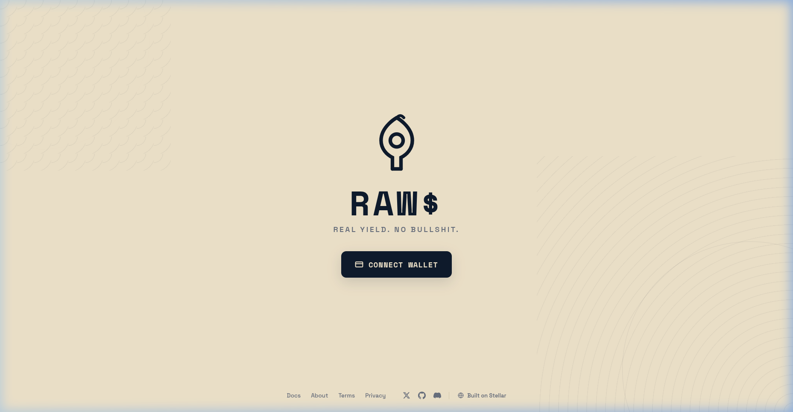
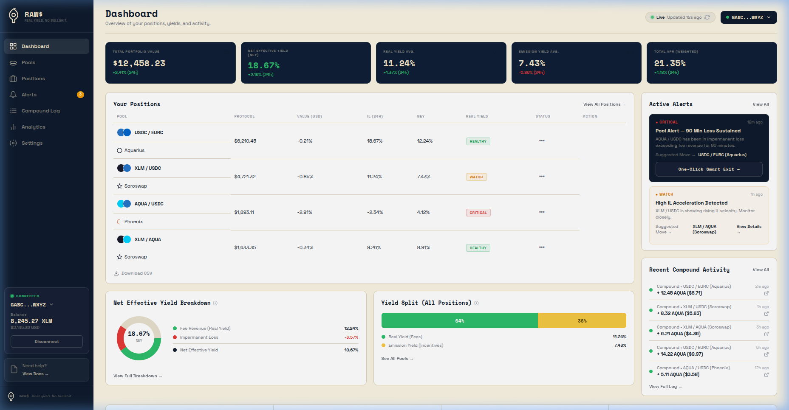
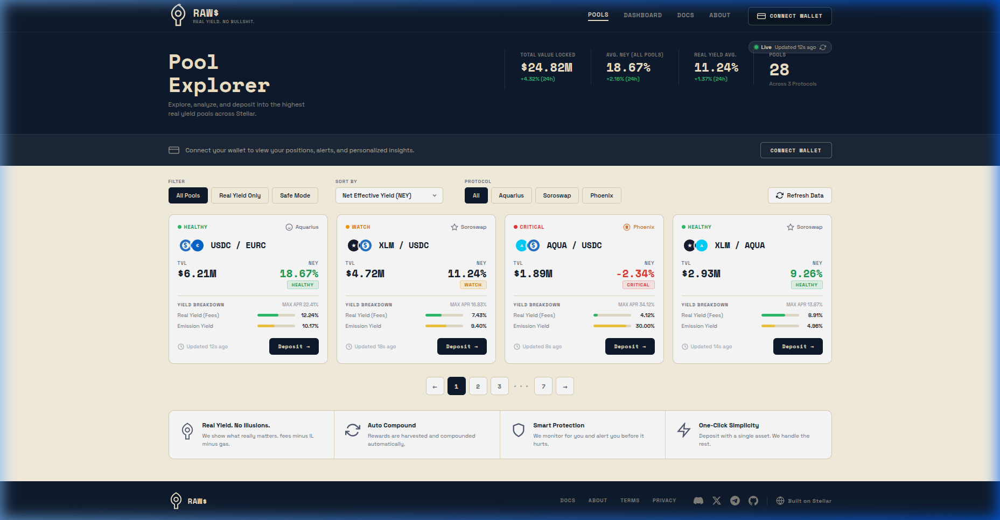
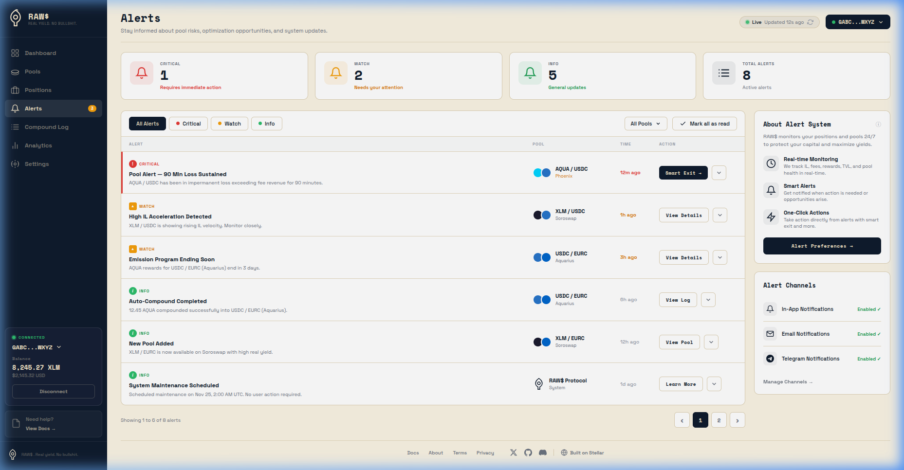
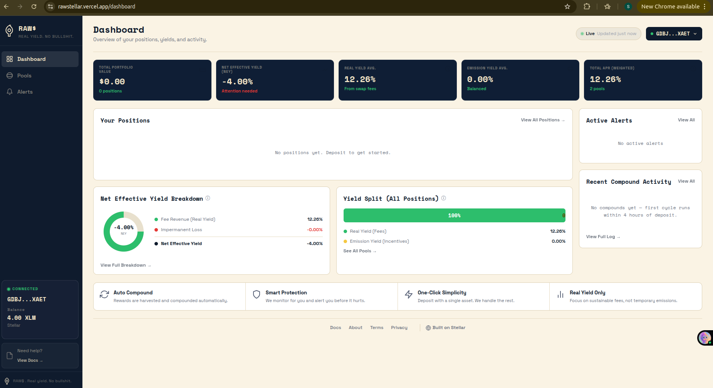

# RAW$

[](LICENSE)
[](#testing)
[](https://stellar.org)

> Real yield or nothing.

RAW$ is a Stellar-native DeFi yield optimizer. Deposit a single token — RAW$
automatically splits it, provides liquidity across DEXes, auto-compounds your
rewards, and shows your **Net Effective Yield** (fees earned minus impermanent
loss) — a metric no other Stellar protocol offers.

## Live

| Resource | URL |
|----------|-----|
| App | https://rawstellar.vercel.app |
| API | https://raws-api.onrender.com |
| GitHub | https://github.com/rue19/raws-protocol |

## Smart Contracts (Stellar Mainnet)

| Contract | Address |
|----------|---------|
| Vault (SafeMode) | `CDSV6OL2STTCBL435NQ5NAVMYFUIODEIXWHDUJ5MRDZL7ATYJUFIOBW7` |
| StableSwap AMM | `CCYLFR7CBMKDVSE5UPIT52UIE6SEARRXMJTXJ4TFNFIMC7EBVWM6XSKV` |
| Deployer / Admin | `GDD6ZI7SPQWJH5CCDFTUQU7SFWJHQ6GMGENS56DN6J2USPSJLT7FGLDM` |
| Keeper | `GCOV557XW4XLD2XZIWSLSH5CIALAS56PWZRSDXL3XDWURENJITFPFEPZ` |

| Dependency | Address |
|------------|---------|
| Soroswap Router | `CAG5LRYQ5JVEUI5TEID72EYOVX44TTUJT5BQR2J6J77FH65PCCFAJDDH` |
| AQUA Token | `CAUIKL3IYGMERDRUN6YSCLWVAKIFG5Q4YJHUKM4S4NJZQIA3BAS6OJPK` |
| USDC (Circle) | `CBIELTK6YBZJU5UP2WWQEUCYKLPU6AUNZ2BQ4WWFEIE3USCIHMXQDAMA` |

## Screenshots

### Landing Page


### Dashboard


### Pool Explorer


### Alerts


### Mainnet — Pool Data


### Mainnet — Deposit Flow


## Features

- **Net Effective Yield (NEY)** — Swap fees earned minus impermanent loss,
  calculated and displayed live. No other Stellar protocol shows this number.

- **Auto-Compounding** — Keeper daemon runs a 4-hour harvest cycle: claims AQUA
  emissions, swaps to LP tokens, and compounds them back into the pool. Fully
  automated, zero user intervention.

- **StableSwap AMM** — Curve-style StableSwap invariant (A=100, 0.04% fee)
  optimized for stable pairs like USDC/EURC. Capital-efficient with minimal
  slippage on pegged assets.

- **Single-Asset Deposit** — Deposit any supported token (XLM, USDC, EURC) in
  one click. The vault calculates the optimal split ratio from on-chain reserves
  and executes all swaps and liquidity additions atomically.

- **Telegram Alerts** — Three severity levels: RED_CRITICAL (sustained negative
  NEY, exit recommended), YELLOW_WARNING (declining pool health), and COMPOUND
  (harvest cycle completions). All alerts include one-click Smart Exit.

- **Smart Exit** — One-click migration from an underperforming pool to a better
  one. Powered by NEY monitoring across all tracked pools. Triggered manually or
  via automated alerts after 90 minutes of negative NEY.

- **Keeper Key Isolation** — The keeper keypair is allowlisted at the contract
  level to call `harvest()` only. It cannot withdraw user funds, modify pool
  parameters, or execute any privileged operation. Compromise of the keeper key
  does not endanger deposits.

- **$0 Infrastructure** — Frontend on Vercel, API and keeper on Render, database
  on Supabase, Stellar RPC via SDF public endpoint, notifications via Telegram
  Bot API. Total monthly infrastructure cost: zero.

## Architecture

```
+------------------+           +-------------------------------+
|      USER        |           |        EXTERNAL               |
| Browser+Wallet   |           | Horizon API | Aquarius API    |
| (Freighter/xBull)|           | Telegram Bot API              |
+--------+---------+           +-------------+-----------------+
         |                                 |
    Deposit Flow                     Keeper Flow
         |                                 |
         v                                 v
+--------+---------------------------------+---------------------+
|                  FRONTEND                                    |
|             Next.js on Vercel                                |
|        Landing | Dashboard | Pools | Alerts                  |
+---------------------------+----------------------------------+
                            |
                            v
+---------------------------+----------------------------------+
|                          API                                 |
|                 Fastify on Render                            |
|         REST + WebSocket + Cron + Telegram webhook           |
+---------------------------+----------------------------------+
                            |
                            v
+---------------------------+----------------------------------+
|                         DATA                                 |
|              Supabase PostgreSQL                             |
|    positions | pool_snapshots | compound_log | alerts        |
|                   Realtime subscriptions                     |
+---------------------------+----------------------------------+
                            |
                            v
+---------------------------+----------------------------------+
|                      CONTRACTS                               |
|                 Stellar Mainnet                              |
|         Vault (deposit/withdraw/harvest)                     |
|         StableSwap AMM (exchange/liquidity)                  |
+---------------------------+----------------------------------+
                            |
                            v
+---------------------------+----------------------------------+
|                        DEXES                                 |
|              Soroswap Router (C2C swaps)                     |
+--------------------------------------------------------------+
```

## How It Works

### Single-Asset Deposit (one click)
1. You deposit any single token (e.g. XLM)
2. Vault calculates the optimal split ratio from on-chain pool reserves using
   the closed-form constant-product formula
3. Contract-to-contract call: Vault → Soroswap router (swap to the pair token)
4. Contract-to-contract call: Vault → target pool add_liquidity
5. dfTokens minted to your address, representing your share
6. All atomic — if any step fails, your funds are returned in full

### Net Effective Yield
```
NEY = swap fee revenue - impermanent loss
```
Shown live on your dashboard. Updated every 30 minutes by the keeper watchdog.
No competitor shows this number.

### Auto-Compound
Every 4 hours, the keeper:
1. Claims pending AQUA emission rewards from Aquarius
2. Swaps AQUA → LP tokens via Soroswap router
3. Calls `vault.harvest()` to add the LP tokens to the pool

At Stellar's $0.00015 tx fee, this is economically positive at any deposit size.

### Degraded Mode (Chain Fallback)
If Supabase is unavailable, the frontend reconstructs positions directly from
on-chain contract events via Horizon. A banner alerts the user that some features
may be limited.

### Keeper Isolation
The keeper is a privileged role restricted to calling `harvest()` only.
User-facing functions (deposit, withdraw) reject keeper callers at the contract
level. Admin-set configuration (router, AMM address) is immutable after first set.

### Pool Health Alerts
If a pool's NEY is negative for 3 consecutive 30-minute periods (90 minutes),
you receive a Telegram notification + in-app alert with a one-click exit to a
better pool.

## Real Yield vs Emission Yield

The dashboard separates:
- **Real Yield** — from actual swap fees. Sustainable indefinitely.
- **Emission Yield** — from AQUA incentives. Ends when the program ends.

## Quick Start (Using the Protocol)

1. Install a Stellar wallet extension: Freighter, xBull, or LOBSTR.
2. Fund your wallet with XLM or a supported stablecoin (USDC/EURC) on Stellar
   mainnet.
3. Visit https://rawstellar.vercel.app
4. Connect your wallet.
5. Select a pool and deposit in one click. The vault handles splitting, swapping,
   and liquidity provision atomically.

## Local Development

### Prerequisites
- Rust + `wasm32-unknown-unknown` target
- Stellar CLI (`cargo install --locked stellar-cli --features opt`)
- Node.js >= 22

### Setup
```bash
git clone https://github.com/rue19/raws-protocol
cd raws-protocol

# Frontend
cd frontend && npm install
cp .env.local.example .env.local  # fill in your values

# Keeper
cd ../keeper && npm install
cp .env.example .env  # fill in your values
```

### Run Locally
```bash
# Terminal 1 — Frontend
cd frontend && npm run dev    # http://localhost:3000

# Terminal 2 — API + Keeper
cd keeper && npm run dev      # http://localhost:3001
```

### Testing
```bash
# Smart contracts (49 tests)
cd contracts && cargo test

# Keeper
cd keeper && npm test
```

## Tech Stack

| Layer | Technology |
|-------|-----------|
| Smart Contracts | Soroban (Rust), soroban-sdk 22.0, Stellar CLI |
| Frontend | Next.js 16, React 19, TypeScript, Tailwind CSS v4, Zustand, Recharts |
| Backend / Keeper | Fastify v4, node-cron, TypeScript, Stellar SDK |
| Database | Supabase (PostgreSQL + Realtime) |
| Infrastructure | Vercel (frontend), Render (API + keeper), Stellar mainnet |
| Wallet | Stellar Wallets Kit (Freighter, xBull, LOBSTR) |

## Security

- **Keeper key isolation:** Keeper keypair is allowlisted at contract level to
  call `harvest()` only. Cannot withdraw user funds even if compromised.
- **Atomic revert:** All C2C calls have `min_out` slippage guards. Any failure
  reverts the entire transaction. Funds never at partial-execution risk.
- **No governance token:** No compliance surface. No emission schedule to manage.
- **Open source:** All contract code auditable on GitHub.

## $0 Infrastructure

| Layer | Tool | Cost |
|-------|------|------|
| Frontend | Next.js + Vercel | Free |
| API + Keeper | Node.js + Render | Free |
| Database | Supabase | Free |
| Stellar RPC | SDF Public | Free |
| Notifications | Telegram Bot API | Free |
| CI/CD | GitHub Actions | Free |
| **Total** | | **$0/month** |

## Contributing

Contributions are welcome. Please create a pull request that includes:

1. What changes or additions you made and why
2. How you solved the problem or implemented the feature
3. Whether your changes have been thoroughly tested

## License

MIT

## Built for Stellar Builders Program 2026

RAW$ — Real yield or nothing.
